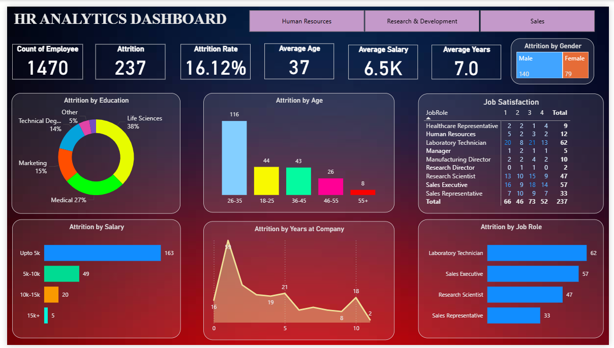

# HR Analytics Dashboard

## Project Overview
This is an **interactive HR Analytics Dashboard** built using **Power BI** to provide insights into employee data, including attrition, demographics, and key HR metrics. The dashboard helps visualize trends and patterns in workforce management, enabling data-driven decision-making.
The dashboard dynamically updates its visuals based on department selection (Human Resources, Research & Development, and Sales).

---

## Dashboard Features

### **Main Page**
The main page provides overall HR insights with the following metrics and visualizations:

1. **Count of Employees** – Total number of employees.  
2. **Attrition Count** – Number of employees who have left.  
3. **Attrition Rate** – Percentage of employees who have left.  
4. **Average Age** – Mean age of employees.  
5. **Average Salary** – Mean salary of employees.  
6. **Average Years at Company** – Mean tenure of employees.  
7. **Attrition by Gender** – TreeMap visualization.  
8. **Attrition by Education** – Donut chart visualization.  
9. **Attrition by Age** – Stacked column chart visualization.  
10. **Job Satisfaction** – Matrix showing employee satisfaction.  
11. **Attrition by Salary** – Stacked bar chart visualization.  
12. **Attrition by Years at Company** – Area chart visualization.  
13. **Attrition by Job Roles** – Stacked bar chart visualization.

### **Department-specific Slicers**
- **Human Resources:** Updates all visuals to show HR department data.  
- **Research & Development:** Updates visuals for R&D department.  
- **Sales:** Updates visuals for Sales department.  

---

## Tools Used
- Power BI Desktop
- DAX (Data Analysis Expressions)
- CSV for dataset

---

## Screenshots

### 1. Main Page

### 2. Human Resources Slicer

### 3. Research & Development

### 4. Sales Slicer

> **Note:** All visuals and metrics update dynamically when a department is selected using the slicers.

--- 
## Files
- `HR_Analytics_Dashboard.pbix` – The main Power BI file
- `HR_Analytics.csv` – Sample HR dataset used
- Screenshots – For visual reference

## How to Use
1. Download the `.pbix` file.
2. Open in **Power BI Desktop**.
3. Refresh the data (if dataset is included) to explore insights.
4. Interact with the dashboard using filters, slicers, and visuals.

